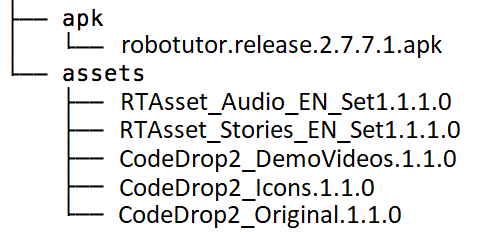

## RoboTutor XPrize System Build

This version was uploaded to XPRIZE on 11/20/2018. For subsequent changes, see [RoboTutorLLC/XPrizeSystemBuild](https://github.com/RoboTutorLLC/XPrizeSystemBuild).

### Setting up adb on Windows

Set up adb on your system using the steps mentioned [here](https://www.xda-developers.com/install-adb-windows-macos-linux/)

### Preparing Installation

1. Go to the [RoboTutor](https://github.com/XPRIZE/GLEXP-Team-RoboTutor-RoboTutor) repository and go to the **Building RoboTutor** section. Follow steps 1-7 to generate the APK robotutor.release.2.7.7.1.apk, and then copy it into the [apk](apk) folder.
3. Go to the [RTAsset_Publisher](https://github.com/XPRIZE/GLEXP-Team-RoboTutor-RTAsset_Publisher) repository and go to the **Setup and Configuration** section. Execute the batch or shell files for English version (suffixed EN) and then copy it into the [assets](assets) folder.
2. Go to the [CodeDrop2_Assets](https://github.com/XPRIZE/GLEXP-Team-RoboTutor-CodeDrop2-Assets) repostiory and go to the **XPrize Pre-Installation process** section. Follow steps 1-4 to generate the following zip files. Transfer these files to the [assets](assets) folder.
	* CodeDrop2_DemoVideos.1.1.0.zip
	* CodeDrop2_Icons.1.1.0.zip
	* CodeDrop2_Original.1.1.0.zip
3. After the listed APKs and assets have been added, your [apk](apk) and [assets](assets) directories should look like this:

4. Once these files are present, continue below to push assets and install APK.

### Steps to install:

1.	Start from a fresh install of Android 7.1.1 (NMF26H)
2.	Navigate to Settings > System > About tablet and tap on build number 7 times to enable Developer options (Note: Steps might vary for different Android versions). From Developer options enable USB debugging
3.	Enable installing apps from unknown sources from Settings.
4.	Connect your Android device to PC via USB. Allow USB debugging on your tablet when prompted.
5.	Run xprize.bat (or xprize.sh on Mac/Linux).
6.	Wait until the script finishes, then open the RoboTutor application from your launcher.
7.	When RoboTutor starts up, it will unzip all the asset files.

### Uninstalling the application

1. Run `xprize_uninstall.bat` (or `xprize_uninstall.sh` on Mac/Linux). This will uninstall the RoboTutor app.

### Build Process

