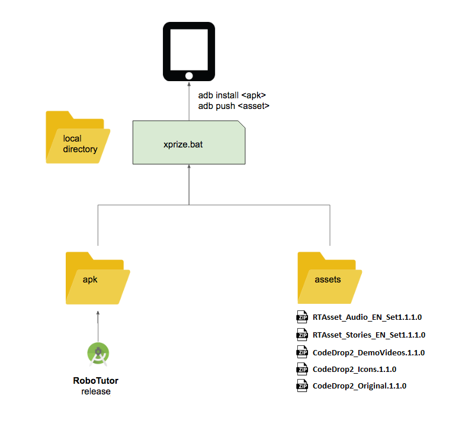

## XPrize System Build

### Preparing Installation

1. Go to the [RoboTutor](https://github.com/XPRIZE/GLEXP-Team-RoboTutor-RoboTutor) repository and go to the **Building RoboTutor** section. Follow steps 1-7 to generate the APK [robotutor.release_sw.1.8.8.1.apk](apk/robotutor.release_sw.1.8.8.1.apk), and then copy it into the [apk](apk) folder.
2. Go to the [RoboLauncher](https://github.com/XPRIZE/GLEXP-Team-RoboTutor-RoboLauncher) repository and go to the **Steps for generating APK** section. Follow steps 1-5 to generate the APK [RoboLaunch.xprize.1.0.0.apk](apk/RoboLaunch.xprize.1.0.0.apk) and then copy it into the [apk](apk) folder.
3. Go to the [RoboTransfer](https://github.com/XPRIZE/GLEXP-Team-RoboTutor-RoboTransfer) repository and go to the **Building Home_Screen** section. Follow steps 1-5 to generate the APK []and copy the APKs into the .
4. Go to the [CodeDrop1_Assets](https://github.com/XPRIZE/GLEXP-Team-RoboTutor-CodeDrop1-Assets) repostiory and go to the **XPrize Pre-Installation process** section. Follow steps 1-4 to generate the following zip files. Transfer these files to the [assets](assets) folder.
	* CodeDrop1_LitAudio.1.1.0.zip
	* CodeDrop1_LitStories.1.1.0.zip
	* CodeDrop1_NumberStories.1.1.0.zip
	* CodeDrop1_ReadingStories.1.1.0.zip
	* CodeDrop1_Songs.1.1.0.zip

5. Go to the [RTAsset_Publisher](https://github.com/XPRIZE/GLEXP-Team-RoboTutor-RTAsset_Publisher) repository and go to the **XPrize Pre-Installation Process** section. Follow steps 1-4 to generate the "RTAsset_Audio_SW_Set1.1.1.0.zip" file. Transfer this file into the [assets](assets) folder.

6. After the listed APKs and assets have been added, your [apk](apk) and [assets](assets) directories should look like this:


7. Once these files are present, continue below to push assets and install APKs.

### Setting up adb on Windows
Follow steps [here](https://www.xda-developers.com/install-adb-windows-macos-linux/)

### Steps to install:

1. Start from a fresh install of Android 7.1.1
2. Enable Developer Options, USB Debugging, Install from unknown sources, etc etc
3. Connect to Android via USB. Allow your RSA to access.
4. You must not have any accounts, Google or otherwise on your device. [How to remove accounts](https://support.google.com/nexus/answer/2840815?hl=en).
5. Run `xprize.bat` (or `xprize.sh` on Mac/Linux). Note that this will put your device into kiosk mode, so that no other system services can be accessed.
6. Wait until the script finishes, then start RoboTutor by tapping on the screen.
7. When RoboTutor starts up, it will unzip all of the asset files.

### Instructions for Testing
0. After installation, you should not be able to pull down the top menu, press the home button, or press the recent button. 
1. While on home screen, tap anywhere on screen.
2. Tap on logo to start FaceLogin.
3. Logging in to FaceLogin
	1. Tap red record button to record a video of yourself.
	2. Tap green smiley to approve.
	3. Tap on your photo in the upper left hand corner
	4. Tap on the green smiley to approve. This should launch RoboTutor
4. If your first time installing, wait for the assets to unzip (there will be a yellow bar on a gray screen).
5. Select any activity area.
6. There may be a demo video that starts before the tutor begins. Wait for this to finish.
7. Exit the tutor by tapping the arrow in the top left corner.
8. On the screen with the faces, tap on the door in the lower right to Exit. This should bring you back to FaceLogin.
9. Repeat steps 3.3 to 8 two or three times. This will generate some log files to be transferred.
10. Check the FTP server for files in the *remote* folder titled "RoboTutor......json".

**Resetting the tablet should bring you back to the RoboTutor home screen**

### To start over:
1. Run `xprize_uninstall.bat` (or `xprize_uninstall.sh` on Mac/Linux). This will uninstall all the RoboTutor apps, release kiosk mode, and release device ownership.

#### Backdoor
1. When on the RTHomeScreen, tap in the upper left corner 16 times. This will release kiosk mode (more backdoor functionality to come).

### Build Process

## **Usage**

 The RoboTutor Global Learning Xprize Submission is licensed under a <a rel="license" href="http://creativecommons.org/licenses/by/4.0/">Creative Commons Attribution 4.0 International License</a>.

